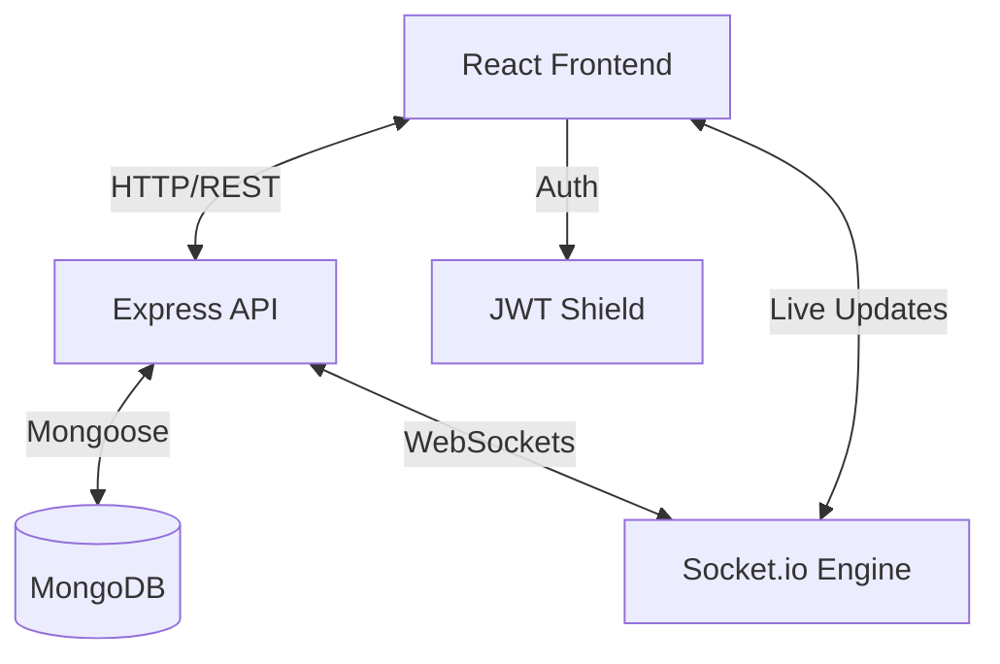
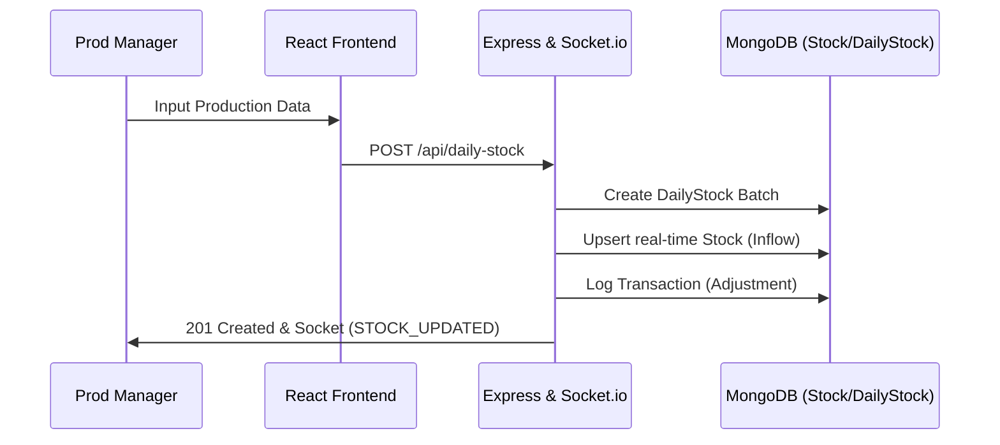
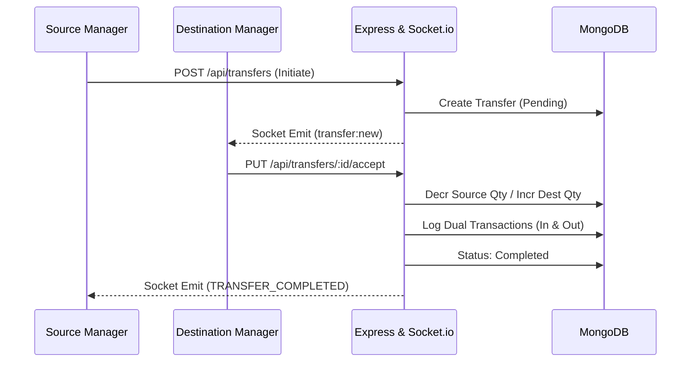

# Rithanya Enterprises CMS

A specialized Canteen Management System designed for tracking production, inventory movement, point-of-sale billing, and comprehensive reporting with real-time auditing and batch-level traceability.

## 🚀 Technologies
- **Frontend**: React (Vite), Tailwind-style Vanilla CSS, Lucide Icons, React-Select.
- **Backend**: Node.js (Express), MongoDB (Mongoose), Socket.io, JWT.
- **Real-time**: Event-driven architecture for live stock updates and notifications.

## 👥 User Roles & Permissions
| Role | Access Level | Responsibilities |
| --- | --- | --- |
| **Superadmin** | Full System | Total visibility and configuration of all units and users. |
| **Admin** | Managerial | User management, product configuration, and global reporting. |
| **Prod Manager**| Unit-Specific | Recording daily production (`DailyStock`) and dispatching transfers to Canteens. |
| **Salesperson** | Canteen-Specific | Point of Sale (POS) billing, accepting transfers, and processing returns. |

## 📦 Full Project Lifecycle (Operational Flow)

The system is built on a "Manufacturing-to-Consumer" logic, ensuring that every item is tracked from its production batch to its final sale or return.

### 1. Production (Inflow)
The journey begins at a **Production Unit**. The Production Manager records the day's output through `DailyStock`. This action:
- Initializes a unique **Batch ID** (`dailyStockId`).
- Increments the Production Unit's real-time **Stock**.
- Logs an **Adjustment Transaction** in the audit ledger.

### 2. Transfer (Movement)
Goods are moved from a Production Unit to a **Canteen** (or between Canteens).
- **Initiation**: The source location dispatches products.
- **Acceptance**: The destination location verifies and accepts the shipment.
- **Traceability**: The `dailyStockId` is passed to the destination, ensuring the canteen knows exactly which production batch it is holding.

### 3. Billing (Outflow)
At the Canteen, the Salesperson processes customer purchases via the **Point of Sale (POS)**.
- **Stock Impact**: Canteen stock is decremented in real-time.
- **Revenue**: Bill numbers are generated with a **3 AM daily reset** logic.
- **Sync**: Originating production records are updated with "sold" counts for end-to-end performance tracking.

### 4. Returns & Reconciliation (Reverse Logistics)
Unused or damaged stock is returned to the Production Unit.
- **Damage/Expiry**: Automatically reconciled to the "Damaged" bucket at the PU.
- **Unsold**: Requires Admin/Manager approval to be restored to "Usable" stock at the Production Unit.

---

## 🏗️ Architecture Visualization

## 🔄 Core Operational Flows (Mermaid)

### 1. Production Flow

### 2. Transfer Flow

## ⚙️ Environment & Setup
**Server Port**: 5000 | **Client Port**: 5173

- Detailed client setup: [client/README.md](file:///e:/freelance-work/rithanya-enterprises-cms/client/README.md)
- Detailed server setup: [server/README.md](file:///e:/freelance-work/rithanya-enterprises-cms/server/README.md)

## 🔒 Security & Data Integrity
- **JWT Authorization**: Secured endpoints for internal operations.
- **Audit Ledger**: All stock movements are recorded in the `Transaction` model via the **Parity Rule** (Stock Modification == Transaction Logging).
- **Batch Isolation**: Inventory is tracked at the batch level (`dailyStockId`) for precise expiry and damage auditing.
